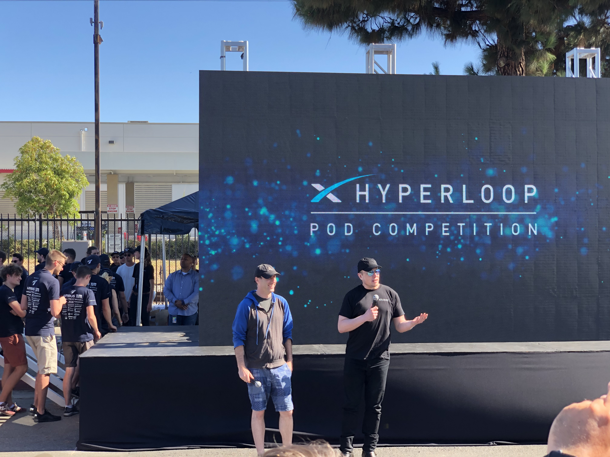
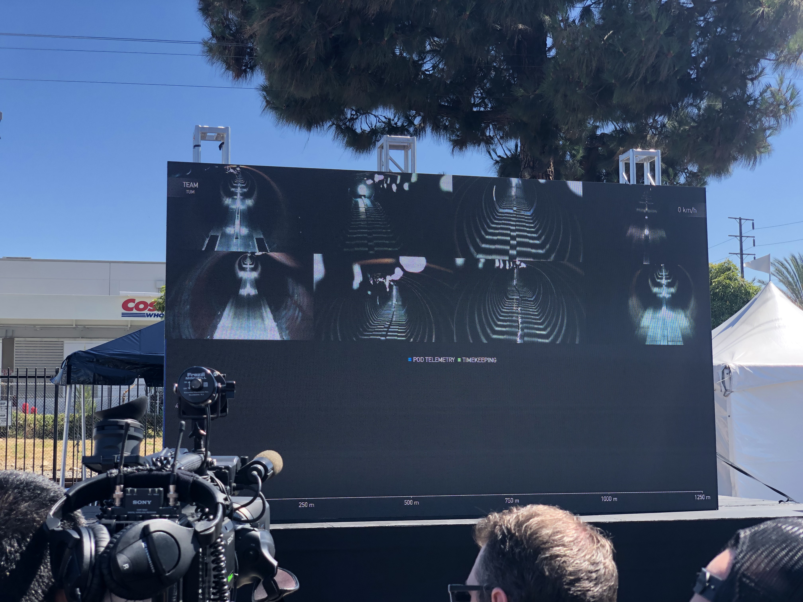
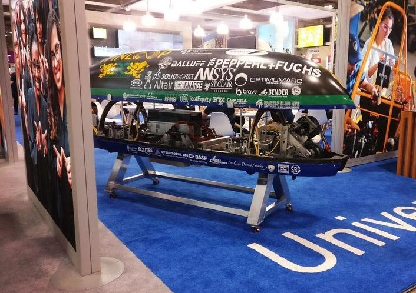
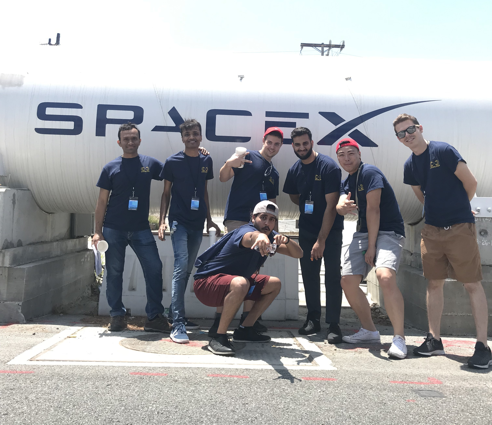
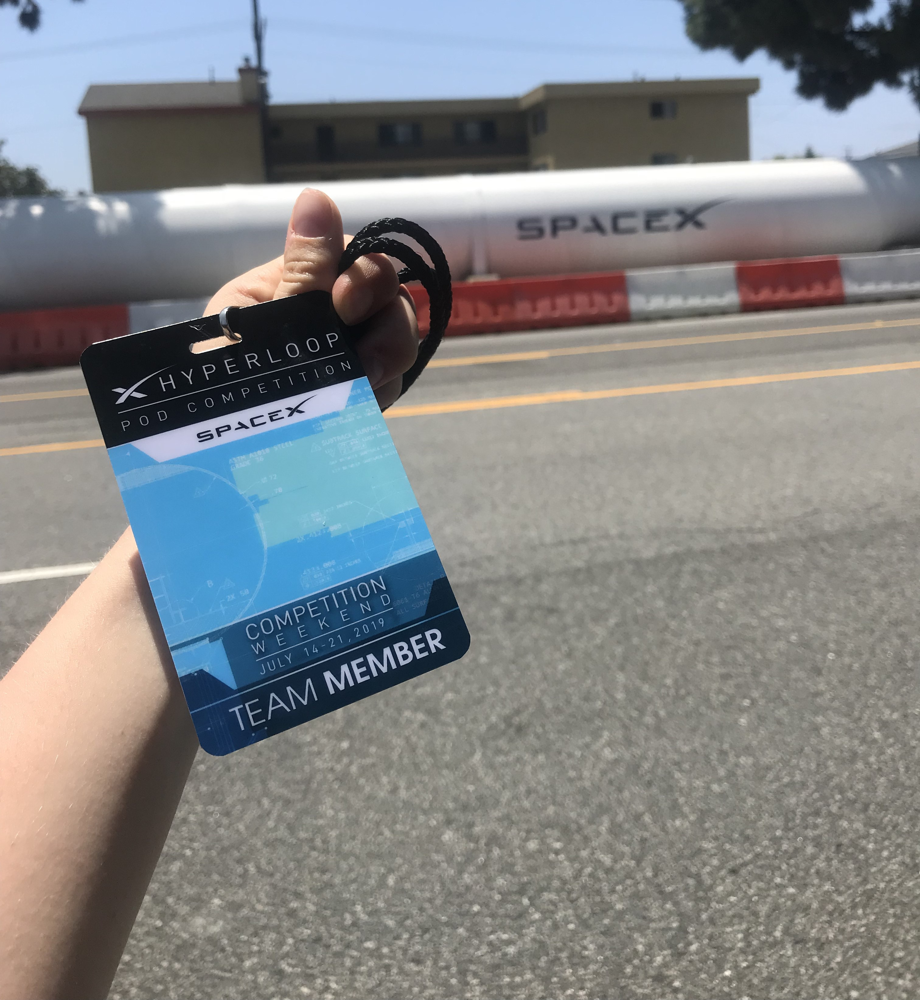
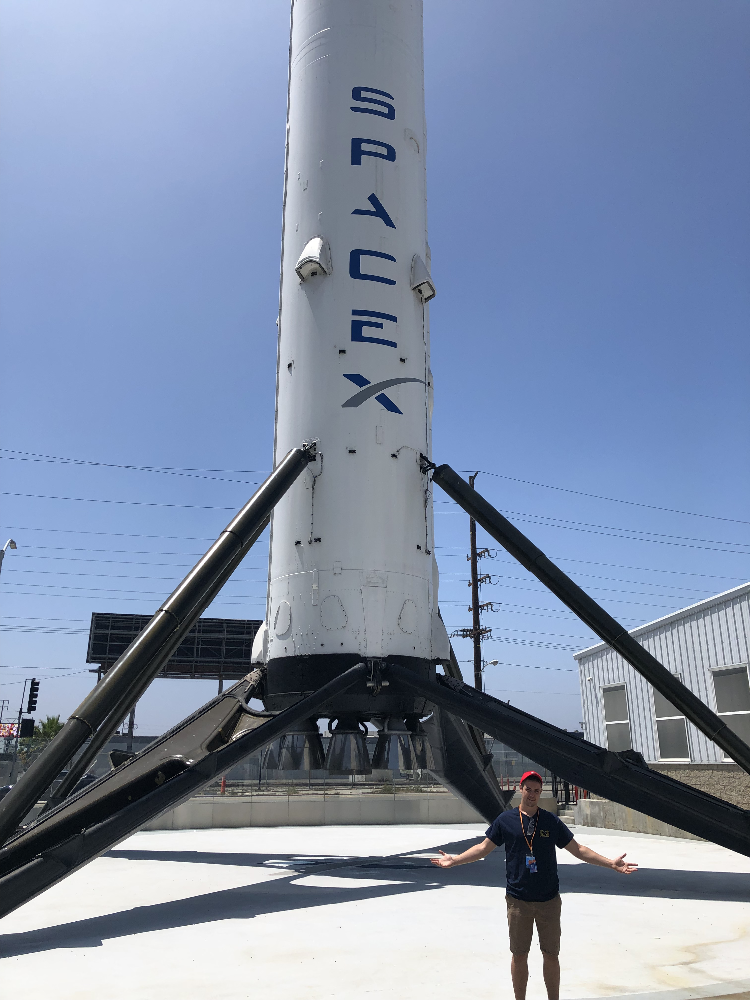

# SpaceX Hyperloop Competition

This repository is dedicated to our participation in the SpaceX Hyperloop competition. The SpaceX Hyperloop Pod Competition is an annual competition organized by SpaceX to encourage university students and engineering teams to design and build Hyperloop pods. For 4 months we took part in weekly meetings with SpaceX engineers and met Elon Musk for our placement in less than 2% of applicants. I am proud to share my experience and collaborate with the community on this innovative project.

| | | |
| - | - | - |
| 

 | 

 | 

 |
| 

 | 

 | 

 |

* For more images of the competition, check out the [Pictures](Pictures) folder.
* For the technical details see the [FDP.pdf](FDP.pdf)
  * Navigate to the Section 5. Propulsion to see my contributions as the Propulsion sub-system team lead.

